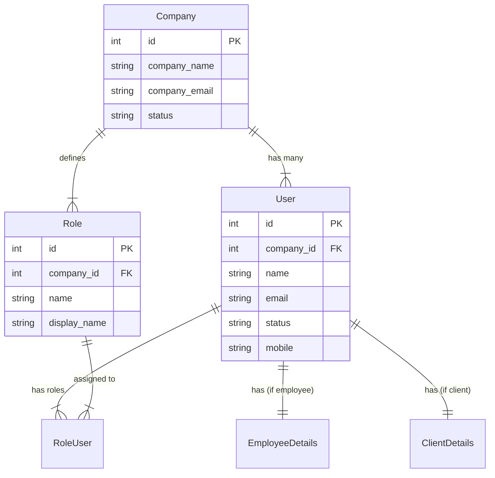
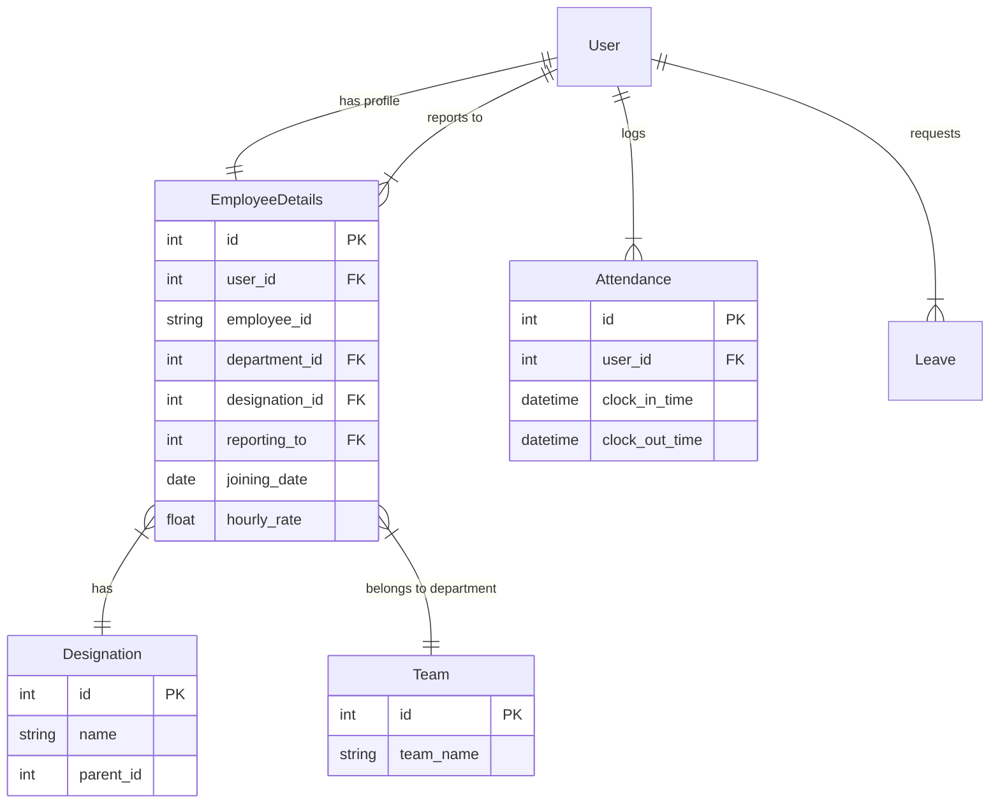
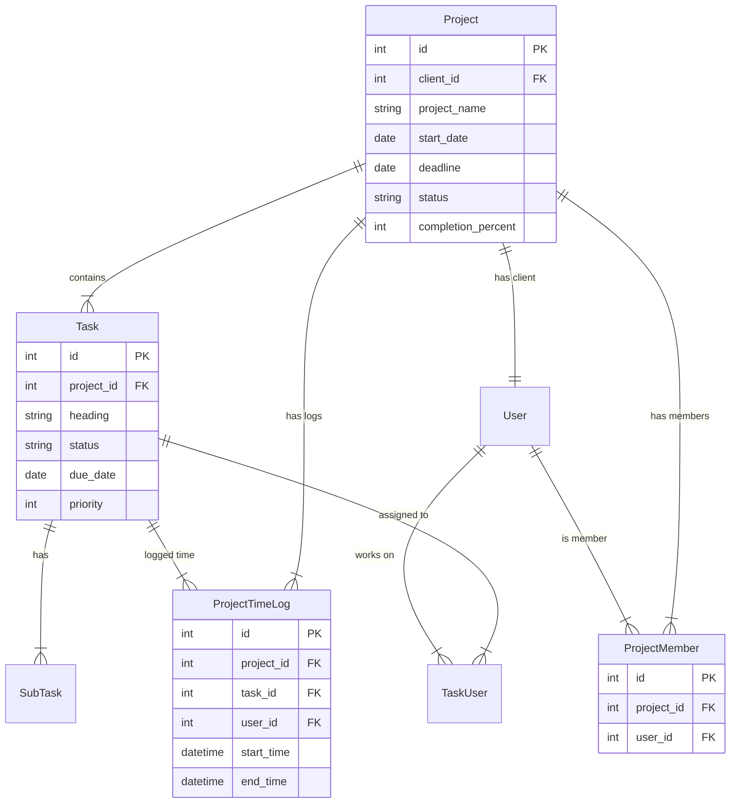
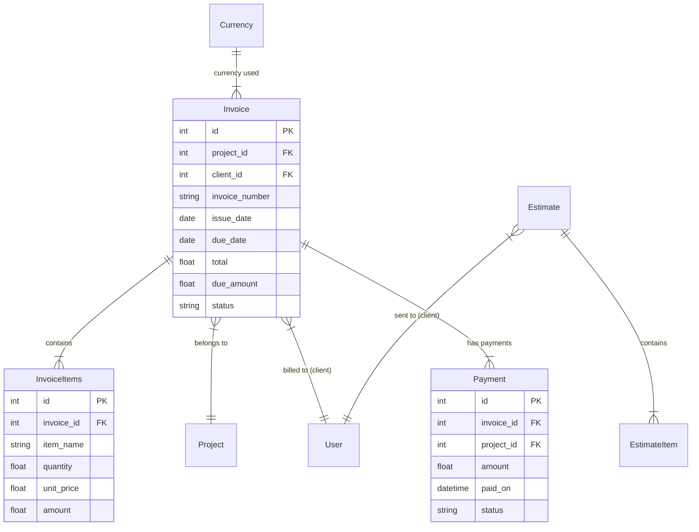
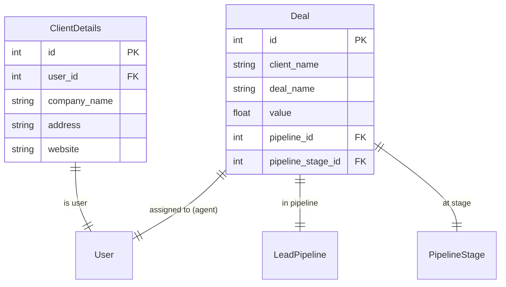

# Entity Relationship Diagram (ERD) - Worksuite

This document provides a high-level overview of the database structure for the Worksuite CRM, broken down by functional modules.

## 1. Core Module

The core module centers around the `Company` and `User` entities. All other modules branch off from these.

## 2. HR Module

Focuses on employee management, structures (departments/designations), and activity (leaves/attendance).

## 3. Project Management Module

Managing projects, tasks, and time tracking.

## 4. Finance Module

Invoicing, payments, and estimates.

## 5. CRM Module

Leads and Deals management.

